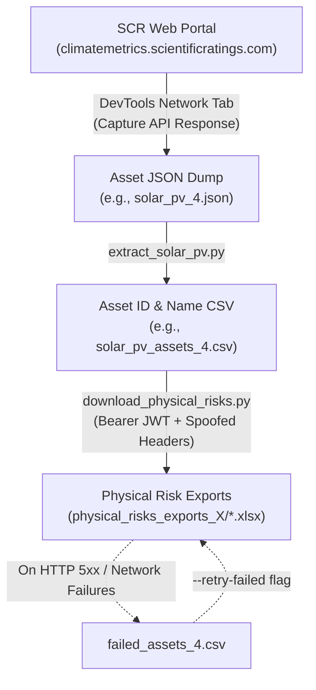

# SCR Asset & Physical Risk Download Workflow (`API_Spoof`)

This directory contains scripts and data files for bulk-exporting asset-level **Physical Climate Risk** Excel reports (`.xlsx`) directly from the **Scientific Climate Ratings (SCR)** platform ([climatemetrics.scientificratings.com](https://climatemetrics.scientificratings.com/)).

Instead of manually navigating and clicking "Export" for thousands of assets in the web UI, this workflow captures portfolio metadata from the web platform and scripts authenticated direct API requests to download risk reports at scale.

---

## High-Level Workflow



---

## File Overview

| File | Type | Description |
| :--- | :--- | :--- |
| [`extract_solar_pv.py`](extract_solar_pv.py) | Python Script | Parses the raw JSON dump from the SCR website and generates a clean CSV with `id` and `asset_name`. |
| [`download_physical_risks.py`](download_physical_risks.py) | Python Script | Iterates through the asset CSV, calls the SCR physical risk export endpoint for each asset ID, and saves the resulting Excel (`.xlsx`) files. |
| `solar_pv_*.json` | Input Data | Raw JSON payload extracted from the SCR portal containing asset records and metadata. |
| `solar_pv_assets_*.csv` | Intermediate Data | Filtered lookup table mapping internal SCR `id` to human-readable `asset_name`. |
| `physical_risks_exports_*/` | Output Directory | Destination directory containing downloaded `<asset_name>_physical_risks.xlsx` files. |
| `failed_assets_*.csv` | Log File | Automatically logged list of assets that failed all retry attempts for subsequent retry passes. |

---

## Step 1: Extracting / Sharing the Asset JSON from the SCR Portal

When viewing a portfolio or asset category (such as Solar PV) on the SCR web platform, the frontend fetches asset records from the SCR backend API.

### How to Capture the JSON:
1. Open Google Chrome (or your preferred browser) and log in to [climatemetrics.scientificratings.com](https://climatemetrics.scientificratings.com/).
2. Open Developer Tools:
   - **Mac**: `Cmd + Option + I`
   - **Windows/Linux**: `F12` or `Ctrl + Shift + I`
3. Go to the **Network** tab and filter by **Fetch/XHR**.
4. Navigate to the asset list view (or change pagination / filters to load the full set of assets).
5. Look for the API request returning asset records (typically returning a JSON object with `meta` and `items`).
6. Click the request, go to the **Response** tab, copy the entire JSON response, and save it inside `API_Spoof/` (e.g. `solar_pv_4.json`).

### JSON Payload Structure:
The script expects a JSON object containing an `items` array with at least `id` and `asset_name`:

```json
{
  "meta": {
    "total_items": 3229,
    "total_pages": 1,
    "nb_page": 1,
    "nb_item": 3229
  },
  "items": [
    {
      "id": 8160,
      "user_id": 20,
      "asset_type": {
        "id": 81,
        "name": "Photovoltaic power generation facility"
      },
      "country": {
        "id": 235,
        "code": "USA",
        "name": "United States"
      },
      "asset_id": "USA_07405",
      "asset_name": "CONUS13K_Cell_267457_MN_MISO_SolarPV",
      "latitude": 43.75,
      "longitude": -95.75
    }
  ]
}
```

- **`id`** (e.g. `8160`): The unique internal numerical identifier used by SCR endpoints to fetch or export specific asset metrics.
- **`asset_name`** (e.g. `CONUS13K_Cell_267457_MN_MISO_SolarPV`): Used to name the downloaded Excel export file for easy identification.

---

## Step 2: Extracting ID and Asset Name (`extract_solar_pv.py`)

[`extract_solar_pv.py`](extract_solar_pv.py) parses the JSON dump and creates a two-column CSV containing only `id` and `asset_name`.

### Configuration:
Open [`extract_solar_pv.py`](extract_solar_pv.py) and update the input and output filenames if working with a new batch:
```python
INPUT_FILE = os.path.join(os.path.dirname(__file__), "solar_pv_4.json")
OUTPUT_FILE = os.path.join(os.path.dirname(__file__), "solar_pv_assets_4.csv")
```

### Execution:
```bash
python3 extract_solar_pv.py
```

### Output:
Generates a CSV file (e.g., `solar_pv_assets_4.csv`) formatted like:
```csv
id,asset_name
8160,CONUS13K_Cell_267457_MN_MISO_SolarPV
8161,CONUS13K_Cell_267458_MN_MISO_SolarPV
8162,CONUS13K_Cell_267459_MN_MISO_SolarPV
```

---

## Step 3: Downloading Physical Risk Excel Files (`download_physical_risks.py`)

[`download_physical_risks.py`](download_physical_risks.py) iterates over each asset in the CSV file and queries the SCR physical risk export endpoint:

```http
GET https://api.scientificratings.com/climate-metrics-service/api/exports/assets/{id}/physical_risks
```

### Prerequisites & Getting a Fresh JWT Token:
Because the SCR API requires authentication, requests must include a valid Bearer JWT:
1. In the browser DevTools **Network** tab on an active session at `climatemetrics.scientificratings.com`, click any request.
2. Under **Request Headers**, locate `Authorization: Bearer <TOKEN>`.
3. Copy everything after `Bearer `.
4. You can provide this token directly via the `--token` CLI argument or update `DEFAULT_TOKEN` in the script.

### Key Script Features:
- **Token Expiry Validation**: Inspects the JWT exp timestamp and alerts if the token has expired or shows how much valid time remains.
- **Idempotency / Skip Existing**: If `<asset_name>_physical_risks.xlsx` already exists in the target directory, it automatically skips the download, allowing seamless resumes without wasted API calls.
- **Rate-Limiting (HTTP 429)**: Honors the `Retry-After` response header and sleeps before retrying.
- **Error Retries (HTTP 5xx & Network)**: Automatically retries up to 3 times with exponential/linear backoff.
- **Failure Logging**: Any asset that fails after 3 attempts is recorded in `failed_assets_X.csv` with its status code, allowing isolated retry runs.

### Command-Line Usage:

#### 1. Standard Run
Downloads all assets using the default configured CSV and output directory:
```bash
python3 download_physical_risks.py
```

#### 2. Provide a Fresh Token
```bash
python3 download_physical_risks.py --token "<NEW_BEARER_TOKEN>"
```

#### 3. Test on a Small Sample
Test with just the first 5 assets to verify credentials and network connectivity:
```bash
python3 download_physical_risks.py --limit 5
```

#### 4. Resume from an Offset
Skip the first `N` assets (useful if resuming a run):
```bash
python3 download_physical_risks.py --start-from 500
```

#### 5. Retry Only Failed Assets
Re-runs only the assets that failed in previous runs (logged in `failed_assets_4.csv`):
```bash
python3 download_physical_risks.py --retry-failed --token "<FRESH_TOKEN>"
```

---

## Step-by-Step Walkthrough for a New Batch

1. **Capture**: Export or save the latest portfolio JSON from the SCR portal into `API_Spoof/solar_pv_N.json`.
2. **Configure Extractor**: In [`extract_solar_pv.py`](extract_solar_pv.py), set:
   ```python
   INPUT_FILE = os.path.join(os.path.dirname(__file__), "solar_pv_N.json")
   OUTPUT_FILE = os.path.join(os.path.dirname(__file__), "solar_pv_assets_N.csv")
   ```
3. **Extract CSV**:
   ```bash
   python3 extract_solar_pv.py
   ```
4. **Configure Downloader**: In [`download_physical_risks.py`](download_physical_risks.py), update target paths:
   ```python
   CSV_FILE   = Path(__file__).parent / "solar_pv_assets_N.csv"
   OUTPUT_DIR = Path(__file__).parent / "physical_risks_exports_N"
   FAILED_LOG = Path(__file__).parent / "failed_assets_N.csv"
   ```
5. **Run Downloader**:
   ```bash
   python3 download_physical_risks.py --token "<CURRENT_JWT_TOKEN>"
   ```
6. **Retry Failures (if needed)**:
   ```bash
   python3 download_physical_risks.py --retry-failed --token "<CURRENT_JWT_TOKEN>"
   ```

---

## Troubleshooting & Status Codes

| Status / Symptom | Cause | Resolution |
| :--- | :--- | :--- |
| **HTTP 401 Unauthorized** | JWT Bearer token has expired. | Copy a fresh Bearer token from the browser DevTools and pass via `--token`. |
| **HTTP 429 Too Many Requests** | Rate limit reached. | The script automatically handles this by waiting for the seconds specified in `Retry-After`. |
| **HTTP 500 / 502 / 503** | Upstream SCR backend error. | The script retries 3 times. If persistent, asset ID is logged to `failed_assets.csv` to retry later. |
| **Empty or 0-byte `.xlsx`** | Download terminated mid-transfer. | Delete the corrupt `.xlsx` file and re-run; the script will re-download it. |
