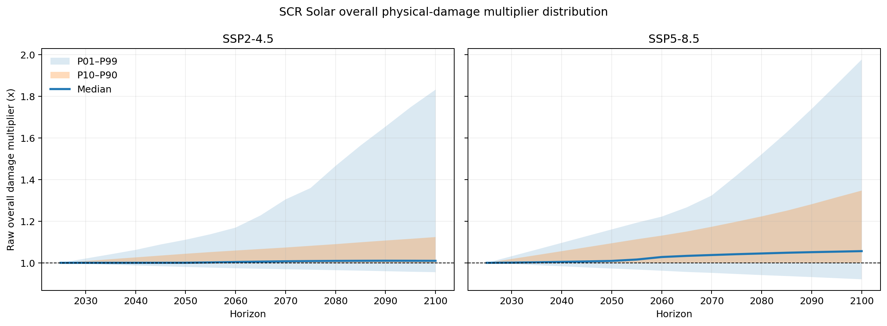
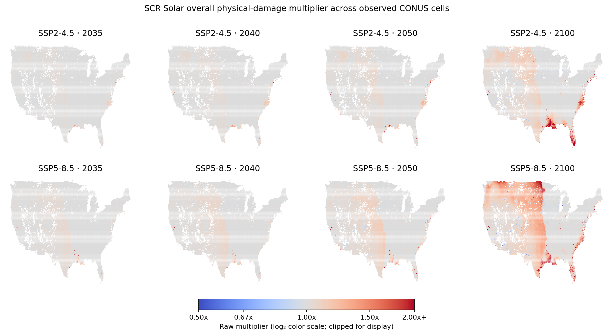

# Full Solar CONUS overall-delta distribution

**Run date:** 2026-08-18
**Metric:** `adjustedTotalDamage`
**Baseline:** 2025 within the same SSP scenario
**Observed workbooks:** 11,928
**Canonical cells without a workbook:** 1,157

## Result in one view

Every observed workbook produced a valid overall multiplier at every five-year
horizon under both scenarios:

```text
11,928 workbooks parsed
        |
        +-- parser errors:             0
        +-- missing 2025 total:        0
        +-- zero 2025 total:           0
        +-- missing future total:      0
        +-- valid factors per slice:  11,928 / 11,928

Canonical-grid coverage: 11,928 / 13,085 = 91.16%
```

The overall delta is therefore highly available wherever a source workbook
exists. The remaining availability issue is the 1,157 absent workbooks, not a
blank `adjustedTotalDamage` field inside returned workbooks.

## Multiplier definition

```text
raw multiplier(cell, scenario, horizon)
  = abs(adjustedTotalDamage at horizon)
    / abs(adjustedTotalDamage at 2025)

percentage change = raw multiplier - 1
```

Interpretation:

| Multiplier | Equivalent change |
|---:|---:|
| `0.90x` | −10% |
| `1.00x` | no modeled change |
| `1.10x` | +10% |
| `1.25x` | +25% |
| `1.50x` | +50% |
| `2.00x` | +100% |

## Selected horizons

The table reports the cross-cell distribution of the per-cell multiplier. It
does not divide national-average future damage by national-average baseline
damage.

| Scenario | Horizon | From 2025 | Median | P10–P90 | P99 | Cells >1.10x | Cells >1.25x | Cells >2x |
|---|---:|---:|---:|---:|---:|---:|---:|---:|
| SSP2-4.5 | 2035 | 10 years | 1.0001x | 1.0000–1.0174x | 1.0410x | 0.32% | 0.07% | 0.01% |
| SSP2-4.5 | 2040 | 15 years | 1.0002x | 1.0000–1.0261x | 1.0621x | 0.64% | 0.12% | 0.02% |
| SSP2-4.5 | 2050 | 25 years | 1.0004x | 1.0000–1.0436x | 1.1109x | 1.20% | 0.34% | 0.06% |
| SSP2-4.5 | 2100 | 75 years | 1.0095x | 1.0000–1.1238x | 1.8323x | 15.85% | 3.22% | 0.82% |
| SSP5-8.5 | 2035 | 10 years | 1.0026x | 1.0000–1.0372x | 1.0638x | 0.49% | 0.11% | 0.02% |
| SSP5-8.5 | 2040 | 15 years | 1.0046x | 1.0000–1.0560x | 1.0960x | 0.80% | 0.20% | 0.03% |
| SSP5-8.5 | 2050 | 25 years | 1.0091x | 1.0000–1.0940x | 1.1605x | 8.28% | 0.52% | 0.09% |
| SSP5-8.5 | 2100 | 75 years | 1.0562x | 1.0000–1.3471x | 1.9770x | 39.68% | 21.34% | 0.91% |

### Read of the distribution

- **2035 and 2040 are modest for almost all cells.** Under both scenarios, 99%
  of observed cells remain below roughly `1.10x` in 2040.
- **SSP5-8.5 separates by 2050.** The median is only `1.009x`, but 8.28% of
  cells exceed `1.10x`; the location signal matters more than the national
  median.
- **2100 is materially wider.** Under SSP5-8.5, the median is `1.056x`, the 90th
  percentile is `1.347x`, and 21.34% of cells exceed `1.25x`.
- **Many values are exactly flat at SCR precision.** P10 remains `1.00x` for all
  selected horizons. A national mean or median alone would hide the upper tail.



## Spatial behavior

The selected-horizon maps show that the later-horizon changes are spatially
coherent rather than only isolated record noise. The 2035 and 2040 surfaces are
mostly neutral. By 2100, SSP5-8.5 shows broader increases across parts of the
central/northern United States, Gulf region, and Atlantic-facing areas. This is
a descriptive pattern in the SCR output; it is not a causal hazard attribution.



## Why maxima cannot be used directly

The raw maxima are much larger than the robust percentiles:

| Scenario | 2035 maximum | 2040 maximum | 2050 maximum | 2100 maximum |
|---|---:|---:|---:|---:|
| SSP2-4.5 | 23.85x | 37.38x | 94.20x | 649.43x |
| SSP5-8.5 | 3.12x | 4.40x | 6.99x | 1,556.75x |

For example, cell `287704` in New Jersey has a 2025 total-damage magnitude near
`4.1e-7`. Its SSP5-8.5 2100 magnitude is approximately `0.000639`, producing a
`1,556.75x` ratio. Conversely, the lowest 2100 ratios also arise from extremely
small values. Cell `312001` in California falls to `0.039x` under SSP5-8.5, but
both its baseline and future magnitudes are below `1e-8`.

Baseline magnitude is highly uneven:

```text
median 2025 magnitude: 0.01
below 1e-8:              142 cells
below 1e-7:          437–442 cells, depending on scenario
below 1e-6:        1,081–1,085 cells
below 1e-5:        2,156–2,166 cells
```

A baseline floor alone does not fully remove the upper tail. At 2100, applying a
`1e-4` experimental floor would exclude roughly 27% of cells yet still leave
raw maxima of `61.28x` under SSP2-4.5 and `35.09x` under SSP5-8.5. Therefore,
the eventual applied multiplier likely needs a combination of:

1. baseline-validity status;
2. absolute-change review;
3. a documented cap or soft compression for the extreme tail; and
4. preservation of the untouched raw factor.

No production threshold is selected by this analysis.

## Recommendation

The overall delta is viable as the primary V1 surface because it is complete in
every returned workbook and has a stable central distribution. Use it as a raw
screening signal with these controls:

```text
raw overall factor
      |
      +-- normal baseline and central range -> candidate direct multiplier
      |
      +-- tiny baseline or extreme tail ----> review/guardrail path
      |
      +-- absent workbook ------------------> missing source, never 1.0x
```

For near-term use, 2035 and 2040 are mostly small adjustments. The stronger
business value appears in the spatial differentiation and in later horizons,
especially SSP5-8.5. Before applying the factor to an InfraSure financial value,
the team still needs to select the exact asset-level loss or cash-flow measure
and approve the guardrail policy.

## Evidence outputs

- `overall_delta_availability_by_horizon.csv`
- `overall_delta_distribution_by_horizon.csv`
- `overall_delta_baseline_distribution.csv`
- `overall_delta_baseline_floor_sensitivity.csv`
- `overall_delta_selected_horizon_outliers.csv`
- `overall_delta_percentile_band.png`
- `overall_delta_selected_horizon_maps.png`

All are stored under
`notebooks/conus_solar_physical_delta/outputs/2026-08-18/`.
